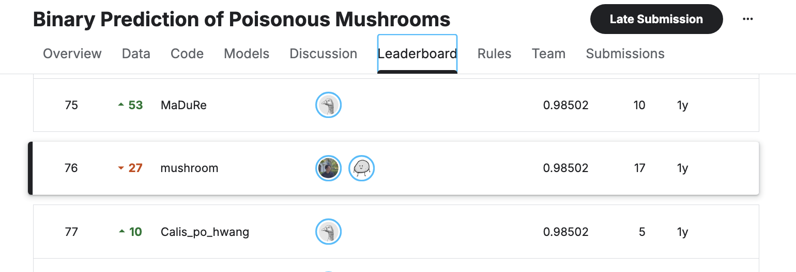

# **Seokhee Chang**  
# **Portfolio**

- **Email**: cycloevan97@gmail.com  
- **GitHub**: https://github.com/seok-hee97  
- **LinkedIn**: https://www.linkedin.com/in/seokhee-chang97/  
- **Hugging Face**: https://huggingface.co/cycloevan

**Core Skills**:  
**Languages**: Python, C, C++, Lua, JavaScript, SQL (MySQL, PostgreSQL, MongoDB), Hive, Bash  
**Libraries & Frameworks**: PyQt, Scikit-Learn, PyTorch, TensorFlow, Pandas, NumPy, Django, Flask, PySpark  
**Tools & Platforms**: Docker, AWS (S3, EC2, API Gateway, Lambda, SageMaker, CloudFormation, Athena), Git, Slack, Discord[1]

***

## **PROJECTS**

### **AI-Powered Code Vulnerability Detection System**
**Meta Llama Academy 1st Cohort | Award: Excellence Award (Korea Radio Promotion Association)**  
**October 2024**

An automated code security analysis system utilizing multi-agent LLM architecture for vulnerability detection, severity assessment, and patch generation.

**Project Overview**:  
- Designed and implemented a multi-LLM agent system that automatically detects security vulnerabilities in source code, evaluates severity using CVE database comparison, and generates remediation patches for high-risk issues  
- Deployed RAG (Retrieval-Augmented Generation) architecture to compare detected vulnerabilities against vectorized CVE database for severity scoring (CVSS 0.0-10.0 scale)  
- Integrated LangChain framework to orchestrate the complete workflow: vulnerability detection → severity assessment → patch generation → report creation

**Key Technologies**:  
- **On-device LLM**: Fine-tuned Llama-3.2-1B model using QLoRA with Hugging Face's code_vulnerability_security DPO dataset for supervised fine-tuning  
- **RAG System**: Vectorized CVE database with similarity-based retrieval for automated CVSS scoring  
- **External LLM**: Solar Pro2 for automated patch code generation for vulnerabilities with CVSS ≥ 7.0  
- **Framework**: LangChain for multi-agent orchestration and workflow integration  

**Validation & Results**:  
- Conducted 5 iterations of random sampling (100 samples each) from 500 validation datasets to verify model performance  
- Successfully automated the entire security review pipeline from code analysis to patch recommendation

**Links**:  
- Code: https://github.com/UpstageAI/edu-usecase/tree/meta-llama-workshop/projects/04-llamaguard  
- Model: https://huggingface.co/cycloevan/vuln_detector  
- Press Coverage: [Meta Blog](https://about.fb.com/ko/news/2025/10/meta-llm-agent-on-device-ai-workshop/), [ETNews Article](https://www.etnews.com/20251002000253)

***

### **Probe Anti-Virus Program**

Enterprise-grade antivirus solution with comprehensive malware detection and system optimization capabilities.

**Project Overview**:  
- Developed complete antivirus application with multiple scan modes (Quick Scan, Deep Scan, Smart Scan) and system optimization features  
- Engineered proprietary malware detection algorithms and integrated them with the core AV engine  
- Implemented quarantine management system and PC optimization module for comprehensive endpoint protection

**Key Features**:  
- **Multi-mode Scanning**: Quick, Deep, and Smart scan capabilities for flexible threat detection  
- **System Optimization**: Built-in PC performance optimization tools  
- **Quarantine Management**: Secure isolation and management of detected threats  
- **Real-time Protection**: Continuous monitoring and threat prevention

**Technologies Used**:  
- **Languages**: Python  
- **Frameworks**: PyQt for GUI development  
- **Database**: SQL for threat signature management  
- **Packaging**: Inno Setup for distribution

**Links**:  
- Crowdfunding Campaign: https://www.wadiz.kr/web/campaign/detail/153064  
- Documentation: https://github.com/seok-hee97/resume/blob/main/docs/Probe-AV.pdf

***

### **ML-WAF (Machine Learning Web Application Firewall)**
**Team Pyree**

High-performance web application firewall leveraging Nginx's event-driven architecture with machine learning-based threat detection.

**Project Overview**:  
- Built scalable WAF system utilizing Nginx's asynchronous I/O structure for ML endpoint REST API calls and MySQL database integration  
- Implemented real-time threat detection using machine learning models for web attack classification  
- Achieved high-performance firewall capabilities through efficient request processing and model inference

**Architecture & Design**:  
- **Event-Driven Processing**: Leveraged Nginx's non-blocking I/O for concurrent request handling  
- **ML Integration**: REST API endpoint for real-time threat classification  
- **Database Layer**: MySQL for logging and attack pattern storage  
- **Containerization**: Docker deployment for scalability and portability

**Technologies Used**:  
- **Languages**: Python, Lua  
- **Frameworks**: Django (admin interface), Flask (ML API), Nginx (proxy layer)  
- **ML Tools**: Jupyter Notebook for model development  
- **Cloud Platform**: AWS (EC2, SageMaker, S3)  
- **Databases**: MySQL, SQLite  
- **DevOps**: Docker for containerization

**Links**:  
- GitHub Repository: https://github.com/Team-Pyree/mlwaf

***

### **KISA AI Challenge 2023**
**Korea Internet & Security Agency**

Network traffic analysis competition focused on attack type multi-class classification.

**Project Overview**:  
- Participated in A-track challenge for network traffic attack classification  
- Developed ML pipeline using TF-IDF vectorization and SVM classifier for multi-class attack detection  
- Achieved competitive performance ranking in top 25% among 70 participants

**Approach & Results**:  
- **Feature Engineering**: TF-IDF (Term Frequency-Inverse Document Frequency) for network traffic pattern extraction  
- **Classification Model**: Support Vector Machine (SVM) for multi-class attack categorization  
- **Performance**: Score of 90.868, ranked 17th out of 70 teams  

**Technologies Used**:  
- **Machine Learning**: Scikit-learn (TF-IDF, SVM)  
- **Languages**: Python  
- **Data Processing**: Pandas, NumPy

**Links**:  
- GitHub Repository: https://github.com/seok-hee97/kisa-ai-2023

***

### **ML-BOOTCAMP 5th**
**Kaggle & Google Gemma Sprint**

Intensive deep learning training program with competitive achievements in Kaggle competition and LLM fine-tuning project.

**Project Overview**:  
- Completed Deep Learning Specialization certification  
- Achieved top 5% ranking in Kaggle competition "Binary Prediction of Poisonous Mushrooms" (76/2,422 participants)  
- Fine-tuned Gemma-2-2B model for GDPR compliance classification

**Competition Achievement**:  
- **Challenge**: Binary Prediction of Poisonous Mushrooms  
- **Ranking**: 76 out of 2,422 participants (top 3.1%)  
  
- **Approach**: Advanced ML techniques for binary classification with imbalanced datasets

**Gemma Sprint Project**:  
- Fine-tuned Google's Gemma-2-2B language model for GDPR-related text classification  
- Specialized model deployment on Hugging Face platform  

**Technologies Used**:  
- **Deep Learning**: TensorFlow, PyTorch  
- **LLM Fine-tuning**: Hugging Face Transformers, Gemma-2  
- **Model Deployment**: Hugging Face Hub  
- **Competition**: Kaggle platform

**Links**:  
- GDPR Project Code: https://github.com/seok-hee97/gdpr-gemma2  
- Fine-tuned Model: https://huggingface.co/cycloevan/gdpr_gemma-2-2b

***

## **AWARDS & RECOGNITION**

**Excellence Award (Korea Radio Promotion Association Director Award)**  
Meta LLM Agent & On-device AI Workshop 1st Cohort  
Organized by: Meta, RAPA, Upstage  
Date: October 2, 2024  
Project: AI Code Review-Based Automated Vulnerability Analysis System (Team 'LLaMA Guard')

***

## **TECHNICAL EXPERTISE**

**Machine Learning & AI**: PyTorch, TensorFlow, Scikit-Learn, Hugging Face Transformers, LLM Fine-tuning (QLoRA, LoRA), RAG Architecture, LangChain  
**Cybersecurity**: Malware Detection, Vulnerability Analysis, Static/Dynamic Analysis, CVE Database, CVSS Scoring, Web Application Firewall  
**Backend Development**: Django, Flask, REST API Design, Nginx, AWS Infrastructure  
**Data Engineering**: PySpark, SQL (MySQL, PostgreSQL, MongoDB), Data Pipeline Development  
**DevOps & Cloud**: Docker, AWS (EC2, S3, Lambda, SageMaker, CloudFormation, Athena), Git

