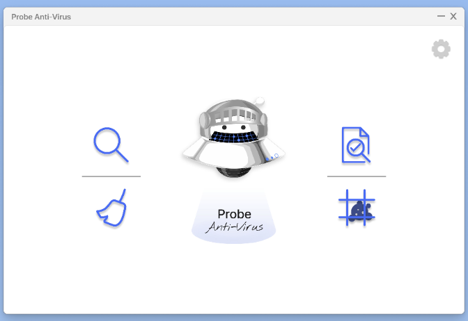
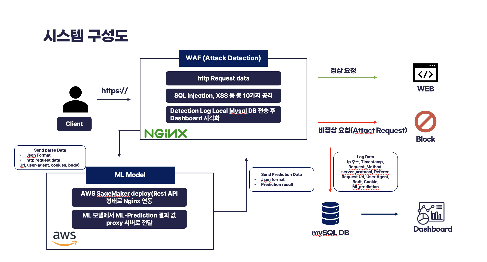

# SeokHee Jang(Evan)

- Mail: <cycloevan97@gmail.com>
- Github : <https://github.com/seok-hee97>
- LinkedIn : [LinkedIn](https://www.linkedin.com/in/seokhee-jang-73142426a/)

## Summary
I am passionate about contributing to the optimization of global issues     
and creating a better future through DL/ML.      

## Military
2017.01 ~ 2018.12 | Republic of Korea Air Force | Honerably Discharged
**Military Specialty:**: Logistics

## Education

- 2016.03 ~ 2023.02 | Gangnam University | Industrial Management Engineering Major/Software Major (Double Major) | Bachelor's degree earned
- 2023.04 ~ 2023.12 | KISIA | SDEV (S-Developer) | Education Certificate
- 2023.11.13 ~ 2023.12.08 | KISIA | Cloud Security | Education Certificate
- 2023.10.27 ~ 2023.11.16 | KISIA | Malware analysis and technology trends using AI | Education Certificate
- 2023.11.22 ~ 2023.11.24 | KISIA | ICT convergence industrial security human resources training project blockchain field | Education Certificate

## Career

- 2021.11 ~ 2023.03 Four Chains     
  Main tasks: data analysis, product development(anti-virus)       

## Skills
Language : Python, C, C++, Lua     
Lib : PyQt, Pytorch, Tensorflow, Pandas, Numpy, Django, Flask     
Tool : Docker, AWS, Git         

## Project 

### Probe Anti-Virus 프로그램

- link : https://wadiz.onelink.me/gmeA/h9i75ge4      
- Main functions: Quick scan, detailed scan, smart scan, PC optimization, quarantine         

###  Ml-WAF   
- link : https://github.com/Team-Pyree/mlwaf    
- About Project: Using Nginx event-driven/async IO structure ML   
  endpoint REST API call and MySQL DB Insert     
  Implementation of high-performance firewall through     
- Lanaguage : Python, Lua     
- framewokr&tool : HTML, Django, Jupyter, Flask, Nginx,       
  AWS(Ec2, Sagemaker, S3), Mysql, SQLite, Docker     

## Certifications
 - Distribution Management (Level 2)
 - Word processor certification
 - Microsoft Office Specialist (MOS) Master
